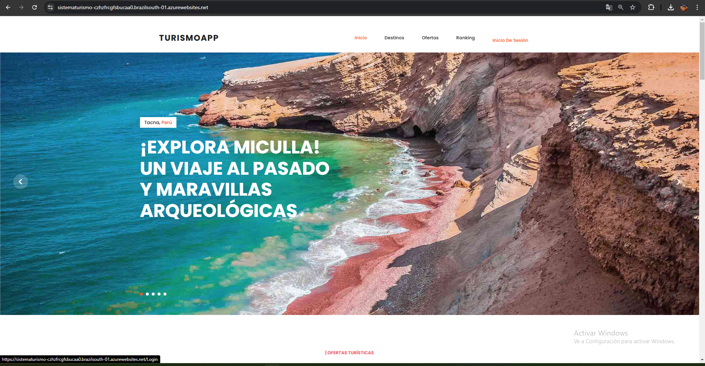
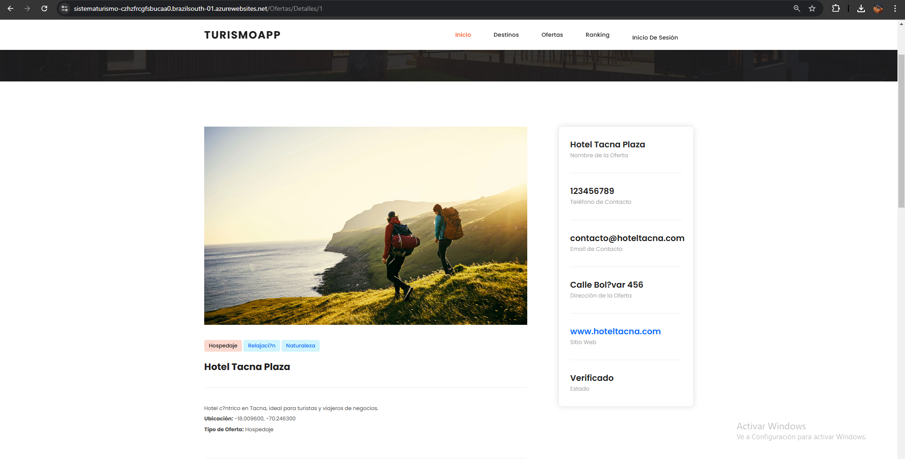
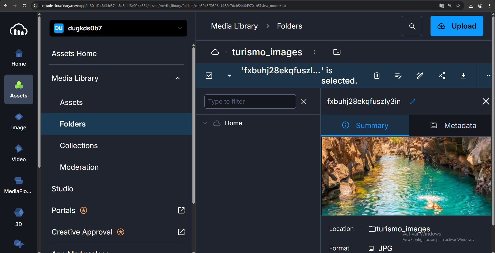
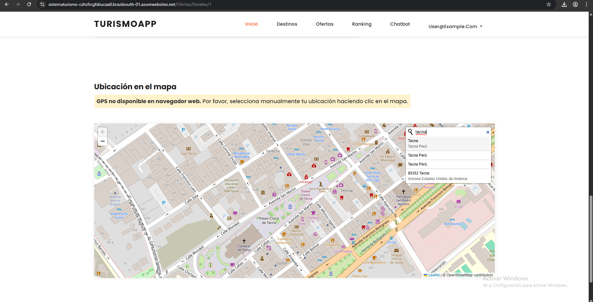
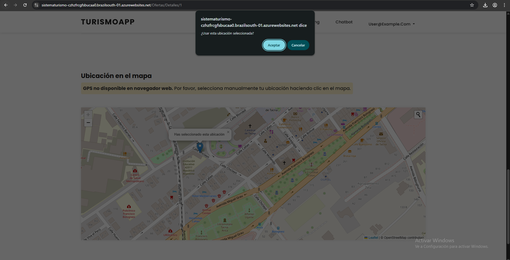
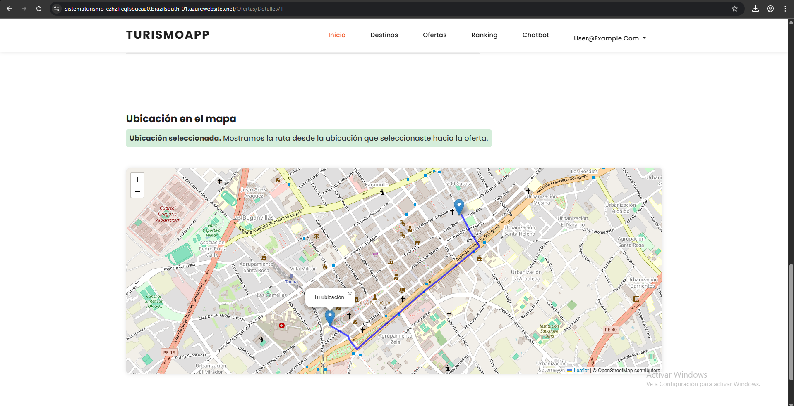

# Proyecto Sistema Turismo

- Anahua Coaquira Mayner Gonzalo
- Zevallos Purca Justin Zinedine

## Índice

- [Proyecto Sistema Turismo](#proyecto-sistema-turismo)
  - [Índice](#índice)
  - [Enlace App Service](#enlace-app-service)
  - [Repositorio de cambios e implementaciones:](#repositorio-de-cambios-e-implementaciones)
  - [Acceso de prueba - Usuarios](#acceso-de-prueba---usuarios)
  - [CONSIDERACIONES](#consideraciones)
  - [Diagrama](#diagrama)
  - [Capturas de la aplicacion](#capturas-de-la-aplicacion)

## Enlace App Service

[sistematurismo.azurewebsites.net](https://sistematurismo-czhzfrcgfsbucaa0.brazilsouth-01.azurewebsites.net/)

```
https://sistematurismo-czhzfrcgfsbucaa0.brazilsouth-01.azurewebsites.net/
```

## Repositorio de cambios e implementaciones:

Repositorio [proyecto-sistema-turismo](https://github.com/MAYnerAC/proyecto-sistema-turismo)

```
https://github.com/MAYnerAC/proyecto-sistema-turismo
```

## Acceso de prueba - Usuarios

| Rol           | Correo electrónico  | Contraseña |
| ------------- | ------------------- | ---------- |
| Administrador | `admin@example.com` | `123456`   |
| Proveedor     | `prov@example.com`  | `123456`   |
| Turista       | `user@example.com`  | `123456`   |

## CONSIDERACIONES

- Clonar el repositorio utilizando git para tener acceso a los recursos necesarios:

  ```bash
  git clone https://github.com/SistemasUPT/sistemamvc-MAYnerAC.git
  ```

- Se ejecuto el siguiente comando para generar el archivo `.gitignore` para el proyecto:

  ```bash
  dotnet new gitignore
  ```

- Por lo que despues de clonar el repositorio se debera restaurar los paquetes NuGet necesarios mediante el siguiente comando en la consola del Administrador de Paquetes de Visual Studio:

  ```bash
  Update-Package -Reinstall
  ```

- Agregar el archivo `.env` en la raiz del proyecto con el siguiente contenido:

```
CLOUD_NAME=cloud_name
API_KEY=api_key
API_SECRET=api_secret
```

- Asegurarse de que la cadena de conexión a la base de datos esté correctamente configurada en el archivo `Web.config`.

## Diagrama


## Capturas de la aplicacion














